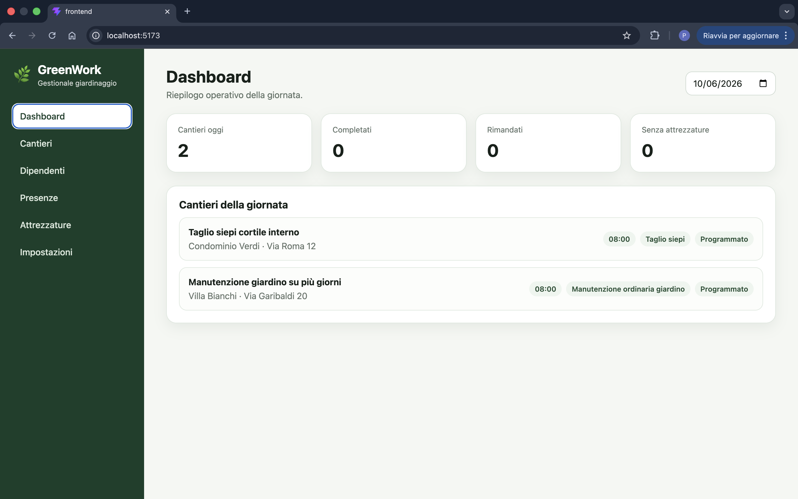
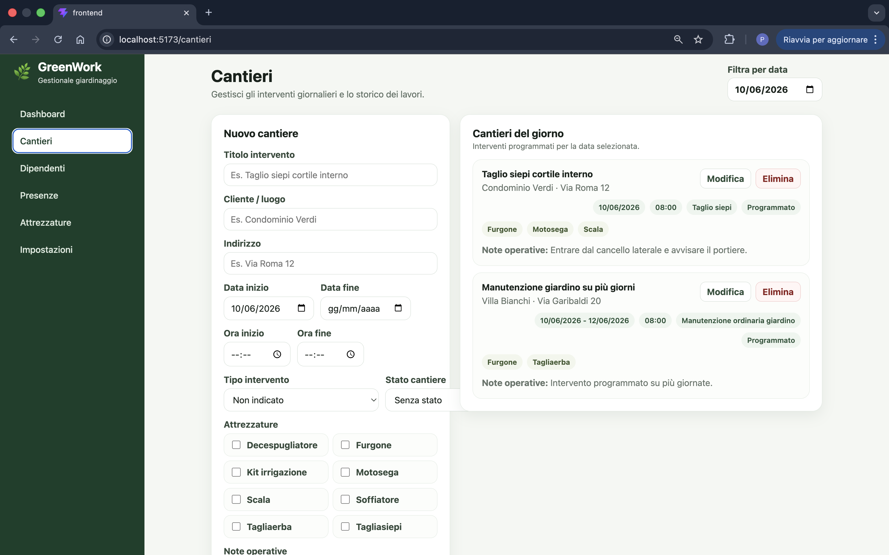
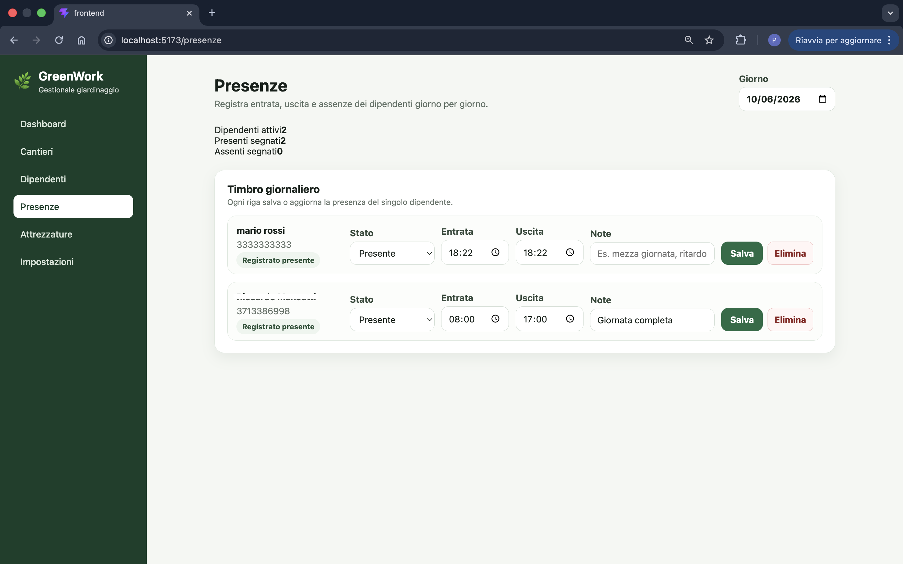
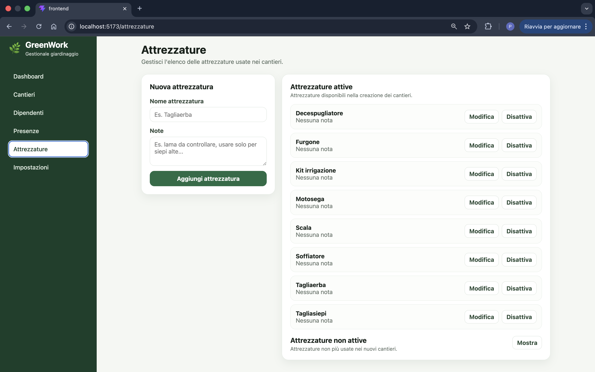

# GreenWork Manager

GreenWork Manager is a full-stack web application designed for small gardening companies that need a simple and practical way to organize daily work.

The application helps manage gardening jobs, employees, equipment, configurable work types, job statuses and daily attendance records.

It was built as both a realistic management tool for a small business and a portfolio project to demonstrate full-stack development with React, TypeScript, Node.js, Express, PostgreSQL and Prisma.

## Live Demo

The application is deployed online and available at:

https://greenwork-manager.onrender.com

Access is protected by an admin login.

The current production setup uses:

* Render for hosting the web service
* Neon for the PostgreSQL database
* GitHub as the source repository
* Prisma for database migrations
* JWT authentication for protected API routes

Because the project is currently hosted on a free Render plan, the first request after a period of inactivity may be slow while the service wakes up.

## Project Status

The project is currently a working first version.

The main operational workflow is implemented:

1. configure work types, job statuses and equipment
2. add and edit employees
3. create and edit gardening jobs
4. manage single-day and multi-day jobs
5. update job status at the end of the day
6. register daily employee attendance
7. view daily scheduled work from the dashboard
8. access the application through an admin login

The application is not intended to cover accounting, invoicing or advanced customer relationship management at this stage.

## Main Features

### Dashboard

The dashboard provides a daily overview of scheduled jobs.

It includes:

* selected day filter
* total jobs for the selected day
* job status summary
* jobs without assigned equipment
* list of jobs active on the selected day

Multi-day jobs are shown on every day between their start date and end date.

### Job Management

Jobs represent gardening interventions or work activities.

Each job can include:

* title
* customer or location name
* address
* scheduled start date
* optional scheduled end date
* scheduled start time
* scheduled end time
* work type
* job status
* assigned equipment
* operational notes
* final notes

Jobs can be edited after creation. This allows the user to update their status, add final notes or mark work as still to be completed.

The customer is intentionally stored as free text inside the job. The project does not currently include a separate customer registry.

### Employee Management

The application allows the user to manage employees.

Each employee can include:

* full name
* phone number
* notes
* active or inactive status

Inactive employees are preserved in the system but are not used by default in daily operations.

### Attendance Tracking

The attendance section allows the user to register employee presence day by day.

Each attendance record includes:

* date
* employee
* present or absent status
* check-in time
* check-out time
* notes

The system prevents duplicate attendance records for the same employee on the same date.

### Equipment Management

The application allows the user to manage gardening equipment.

Each equipment item can include:

* name
* notes
* active or inactive status

Equipment can be assigned to jobs.

### Configurable Work Types

The list of work types is configurable by the user.

Examples:

* lawn mowing
* hedge trimming
* pruning
* garden maintenance
* irrigation check

Work types can be created, edited, activated, deactivated and deleted when possible.

### Configurable Job Statuses

The list of job statuses is configurable by the user.

Examples:

* scheduled
* in progress
* completed
* to be completed
* postponed
* cancelled
* suspended due to rain

Job statuses can be created, edited, activated, deactivated and deleted when possible.

### Authentication

The application includes a basic admin login system.

Current authentication features:

* admin login
* JWT-based authentication
* protected API routes
* password hashing with bcrypt
* login rate limiting
* logout support

There is no public registration flow. The application is intended as a private management tool.

### Dashboard



### Jobs



### Attendance



### Tools



If screenshots are not available yet, this section can be removed temporarily.

## Tech Stack

### Frontend

* React
* TypeScript
* Vite
* React Router

### Backend

* Node.js
* Express
* TypeScript
* Prisma ORM
* PostgreSQL

### Security and Production Utilities

* JWT
* bcrypt
* Helmet
* express-rate-limit
* CORS configuration

### Hosting

* Render
* Neon PostgreSQL

## Repository Structure

```text
greenwork_manager/
├── backend/
│   ├── prisma/
│   │   ├── migrations/
│   │   ├── schema.prisma
│   │   └── seed.ts
│   └── src/
│       ├── config/
│       ├── lib/
│       ├── middleware/
│       └── routes/
├── frontend/
│   └── src/
│       ├── components/
│       ├── layouts/
│       ├── pages/
│       ├── services/
│       └── types/
├── docs/
│   ├── requirements.md
│   ├── roadmap.md
│   └── screenshots/
└── README.md
```

## Local Development Setup

The project uses a monorepo structure with separate `frontend` and `backend` folders.

### Prerequisites

Before running the project locally, install:

* Node.js
* npm
* PostgreSQL
* Git

### 1. Clone the repository

```bash
git clone https://github.com/hipietro/greenwork_manager.git
cd greenwork_manager
```

### 2. Backend setup

Move into the backend folder:

```bash
cd backend
npm install
```

Create a local `.env` file inside the `backend` folder.

You can start from the example file:

```bash
cp .env.example .env
```

Example local `.env`:

```env
DATABASE_URL="postgresql://postgres@localhost:5432/greenwork_manager?schema=public"

ADMIN_USERNAME="admin"
ADMIN_PASSWORD="change_this_password"

JWT_SECRET="change_this_with_a_long_random_secret"

CORS_ORIGIN="http://localhost:5173,http://localhost:3000"

NODE_ENV="development"
PORT="3000"
```

Generate a secure JWT secret with:

```bash
node -e "console.log(require('crypto').randomBytes(64).toString('hex'))"
```

Run database migrations:

```bash
npx prisma migrate dev
```

Seed the database:

```bash
npm run seed
```

Start the backend development server:

```bash
npm run dev
```

The backend runs on:

```text
http://localhost:3000
```

### 3. Frontend setup

Open another terminal and move into the frontend folder:

```bash
cd frontend
npm install
npm run dev
```

The frontend runs on:

```text
http://localhost:5173
```

In development, Vite proxies frontend API calls from `/api` to the backend running on `http://localhost:3000`.

### 4. Login locally

After seeding the database, use the admin credentials defined in the backend `.env` file:

```text
username: admin
password: value of ADMIN_PASSWORD
```

## Production-like Local Test

To test the app locally as a single full-stack service, first build the frontend:

```bash
cd frontend
npm run build
```

Then build and start the backend in production mode:

```bash
cd ../backend
npm run build
NODE_ENV=production npm start
```

Open:

```text
http://localhost:3000
```

In production mode, the Express backend serves the compiled React frontend from `frontend/dist`.

## Deployment

The application is deployed as a single-service full-stack app.

Production setup:

```text
GitHub repository
        ↓
Render Web Service
        ↓
Express backend
        ↓
Serves React production build
        ↓
Connects to Neon PostgreSQL
```

### Render Configuration

Recommended Render settings:

```text
Runtime: Node
Branch: main
Root Directory: empty
```

The root directory is left empty because the repository contains both `frontend` and `backend`.

### Build Command

```bash
cd frontend && npm install --include=dev && npm run build && cd ../backend && npm install --include=dev && npx prisma generate && npx prisma migrate deploy && npm run seed && npm run build
```

This command:

1. installs frontend dependencies
2. builds the React frontend
3. installs backend dependencies
4. generates the Prisma client
5. applies pending Prisma migrations to the production database
6. seeds initial configuration data and the admin user
7. builds the backend TypeScript code

### Start Command

```bash
cd backend && npm start
```

### Render Environment Variables

The following environment variables must be configured in Render:

```env
NODE_ENV=production

DATABASE_URL=postgresql://your_neon_connection_string

ADMIN_USERNAME=admin
ADMIN_PASSWORD=your_secure_admin_password

JWT_SECRET=your_long_random_secret

CORS_ORIGIN=https://your-render-service.onrender.com
```

Important notes:

* do not commit real environment variables to GitHub
* do not include quotes around values in the Render dashboard
* `DATABASE_URL` must start with `postgresql://` or `postgres://`
* `ADMIN_PASSWORD` is used by the seed script to create or update the admin user
* changing `JWT_SECRET` invalidates existing login sessions

### Database

The production database is hosted on Neon.

Prisma uses the `DATABASE_URL` environment variable to connect to the database.

In development, use:

```bash
npx prisma migrate dev
```

In production, use:

```bash
npx prisma migrate deploy
```

The Render build command already runs `npx prisma migrate deploy`.

## Updating the Deployed App

To update the live application:

1. make changes locally
2. test the changes locally
3. run frontend and backend builds
4. commit the changes
5. push to the `main` branch
6. Render automatically redeploys the latest version

Typical workflow:

```bash
git status
git add .
git commit -m "Short change description" -m "Longer explanation of the change."
git push origin main
```

If the change modifies the database schema, create a migration locally before pushing:

```bash
cd backend
npx prisma migrate dev --name migration_name
npx prisma generate
```

Render will apply pending migrations online through:

```bash
npx prisma migrate deploy
```

## Security Notes

The application includes a basic admin login system.

Current security measures:

* JWT-based authentication
* protected API routes
* password hashing with bcrypt
* login rate limiting
* Helmet security headers
* configurable CORS origin
* request body size limit
* no public user registration

The current authentication system is intentionally simple and designed for a small private management tool.

Future security improvements may include:

* HttpOnly cookie-based sessions
* user roles
* password reset flow
* audit logs
* stronger input validation

## Current Limitations

The current version does not include:

* invoicing
* estimates
* accounting
* advanced customer management
* role-based permissions
* payroll calculations
* advanced reports
* automated tests
* mobile app
* backup management from the UI

## Future Improvements

Planned improvements include:

* CSV export
* better search and filtering
* weekly job view
* job detail page
* completed jobs report
* attendance report
* dashboard statistics improvements
* responsive UI refinements
* automated tests
* backup/export tools
* stronger authentication model

## Goal of the Project

The goal of GreenWork Manager is to provide a realistic small-business management system while keeping the application simple, practical and easy to extend.

It is also intended as a portfolio project to demonstrate:

* full-stack development
* database design
* REST API development
* authentication
* deployment
* project documentation
* practical problem solving for a real business context
